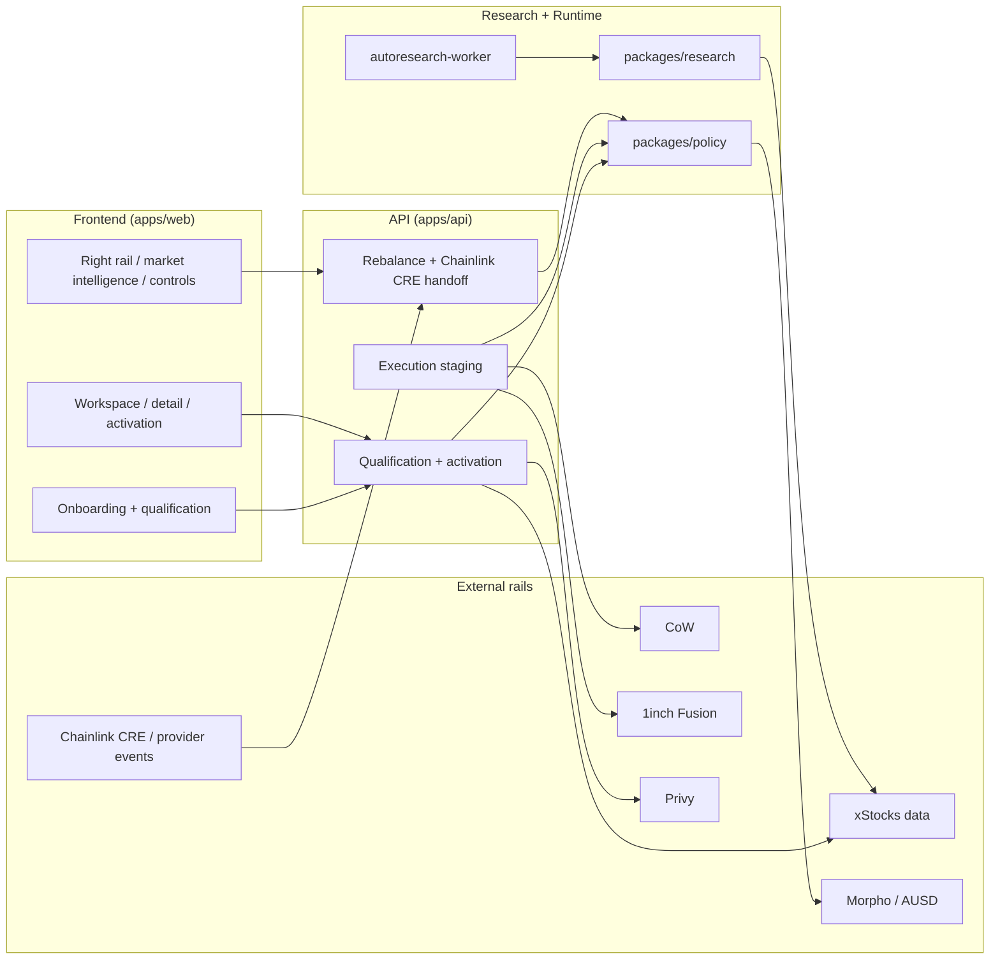

# 24-7 MARKETS

`xStocks Strategy Lab` is the internal monorepo name for the codebase that powers `24-7 MARKETS`.

`24-7 MARKETS` is an xStocks portfolio product for people who want to:
1. answer a short qualification flow and get a portfolio matched to their profile,
2. understand why that portfolio was chosen,
3. activate the portfolio and see whether execution is actually ready,
4. follow rebalance and `Chainlink CRE`-driven change signals without pretending automation is further along than it is.

The current public frontend is [24-7.markets](https://24-7.markets).

## What 24-7 MARKETS Does

At the product level, the current repo supports:
1. qualification into a promoted xStocks basket,
2. portfolio explanation and manifest-backed recommendation surfaces,
3. authenticated activation save and execution staging,
4. venue-routed execution planning across `CoW` and `1inch`,
5. `Chainlink CRE` / provider-triggered rebalance review and staged follow-up actions.

## Product Surfaces

### Autopilot

`Autopilot` is the main xStocks basket product:
1. qualify the user from onboarding answers,
2. map the user into a promoted manifest slot,
3. explain the recommended portfolio,
4. save authenticated activations,
5. stage execution through the backend execution substrate.

The onboarding gate now exposes the optimisation method explicitly as `AUTORESEARCH`, reflecting the repo-owned qualification -> slot-registry -> promoted-manifest loop.

### Directional

The repo also carries a directional xStocks lane:
1. single-asset directional qualification and preview,
2. route and risk visibility,
3. activation-readiness visibility,
4. but still with narrower live proof than the basket-first Autopilot flow.

## Execution And Rebalance Truth

Current execution hierarchy:
1. `CoW` and `1inch` are the repo-owned Ethereum execution venues in the backend substrate,
2. `1inch` is no longer quote-only; it persists quote, approval payload, signed submission attempt, and venue-status or exact blocker,
3. `CoW` remains supported through the same execution-request contract,
4. `Chainlink CRE` / provider-triggered review can now create execution staging through the landed `XSL-018B` handoff,
5. execution still fails closed when readiness, quoteability, signer, or session blockers remain.

Current truthful posture:
1. `Chainlink CRE` review + operator-triggered execution staging is real,
2. full autonomous CRE/provider execution is not,
3. whole-portfolio execution is the contract shape, and the promoted default `c5` basket is now executable under venue-routed `1inch` truth for its six core xStocks legs,
4. exact remaining blocker is signer-owned `1inch Fusion` signature, submission, and receipt proof, while the `AUSD` yield-buffer leg remains deferred/manual.

## Wallet And Auth Truth

Current wallet/auth posture:
1. Privy authentication is real in the frontend and backend,
2. live proof already reached the authenticated execution boundary with a real user session,
3. the current execution lane does not strictly require a Privy smart account,
4. smart-account scaffolding exists, but linked-wallet / embedded-wallet signer flow is still the current proven runtime branch,
5. smart-account-first execution remains an active `XSL-005` posture lane, but it is not yet the canonical proven runtime branch.

## Autoresearch Truth

`Autoresearch` in this repo means:
1. evaluate candidate portfolios against the pinned research bundle,
2. keep incumbent-vs-challenger comparisons,
3. promote the current winner into the slot registry,
4. expose that promoted manifest to the API and frontend,
5. rerun the loop on the Railway `autoresearch-worker`.

This does not mean portfolio execution is already fully autonomous.

## Current Repo Truth

As of `2026-04-02`, the strongest repo-owned truth is:
1. onboarding qualification, workspace/detail, activation preview, and authenticated activation surfaces exist,
2. Railway-backed autoresearch is repo-owned and promotes manifests into the public slot registry,
3. the backend owns a shared `ExecutionRequest` / `ExecutionRequestLeg` contract for venue-routed execution across `CoW` and `1inch`,
4. accepted `Chainlink CRE` / provider-triggered review can now hand off into canonical execution staging through `execute_all` under landed `XSL-018B`,
5. execution is still user-approved and signer-owned,
6. landed `XSL-014B` makes the promoted default `c5` basket truthfully `ready` / `executable` on the promoted path under venue-routed `1inch.ethereum` truth,
7. full autonomous rebalancing is not live.

What is not true yet:
1. the strongest exact execution claim for the promoted `c5` basket is still limited to the six core xStocks legs, with the `AUSD` yield-buffer leg intentionally deferred/manual,
2. provider-triggered `CRE` does not autonomously execute end to end,
3. hosted/session-backed signer proof is not closed as a durable production claim,
4. exact remaining execution blocker: signer-owned `1inch Fusion` EIP-712 signatures, submission, and receipt proof for the six quoted core legs,
5. Privy smart-account-first execution remains an active `XSL-005` posture lane, not the current proven runtime branch.

## Architecture



## Monorepo Layout

```text
apps/
  web/       Next.js terminal frontend on Vercel
  api/       Railway API service and proof surfaces
  worker/    Railway autoresearch cron runtime

packages/
  shared/    shared schemas and contracts
  policy/    qualification, readiness, rebalance, execution planning
  research/  Strategy Lab evaluation, promoted manifests, slot registry
  xstocks/   xStocks venue and asset adapters
  euler/     directional and rail helpers
```

## Getting Started

Install and run the monorepo:

```bash
pnpm install
pnpm build
pnpm test
```

Common local commands:

```bash
pnpm dev
pnpm --filter @xstocks-strategy-lab/web build
pnpm --filter @xstocks-strategy-lab/web test
node --test apps/api/test/api.test.js
node --test apps/api/test/provider-rebalance-api.test.js
node --test apps/api/test/rebalance-service.test.js
pnpm --filter @xstocks-strategy-lab/xstocks test
pnpm --filter @xstocks-strategy-lab/policy test
```

Shared env is expected through `~/.config/attn/shared.env` or `XSTOCKS_SHARED_ENV_PATH`. Do not commit live access tokens or operator secrets.

## Planning Surface

The repo uses [docs/ISSUES.md](/Users/user/PycharmProjects/xstocks-strategy-lab/docs/ISSUES.md) plus execution-grade specs under [docs/plans/active/README.md](/Users/user/PycharmProjects/xstocks-strategy-lab/docs/plans/active/README.md) as the system of record.

Start here:
1. [docs/ISSUES.md](/Users/user/PycharmProjects/xstocks-strategy-lab/docs/ISSUES.md)
2. [docs/plans/active/README.md](/Users/user/PycharmProjects/xstocks-strategy-lab/docs/plans/active/README.md)
3. [2026-03-31-xstocks-product-control-plane.md](/Users/user/PycharmProjects/xstocks-strategy-lab/docs/plans/active/2026-03-31-xstocks-product-control-plane.md)
4. [2026-03-31-xstocks-execution-funding-and-rails-spec.md](/Users/user/PycharmProjects/xstocks-strategy-lab/docs/plans/active/2026-03-31-xstocks-execution-funding-and-rails-spec.md)
5. [2026-04-01-xstocks-chainlink-cre-provider-triggered-rebalance-spec.md](/Users/user/PycharmProjects/xstocks-strategy-lab/docs/plans/active/2026-04-01-xstocks-chainlink-cre-provider-triggered-rebalance-spec.md)
6. [2026-04-01-xstocks-provider-to-execution-handoff-spec.md](/Users/user/PycharmProjects/xstocks-strategy-lab/docs/plans/active/2026-04-01-xstocks-provider-to-execution-handoff-spec.md)
7. [2026-04-01-xstocks-privy-smart-account-and-linked-wallet-live-boundary-spec.md](/Users/user/PycharmProjects/xstocks-strategy-lab/docs/plans/active/2026-04-01-xstocks-privy-smart-account-and-linked-wallet-live-boundary-spec.md)
8. [2026-04-01-xstocks-oneinch-manual-execution-substrate.md](/Users/user/PycharmProjects/xstocks-strategy-lab/docs/plans/completed/2026-04-01-xstocks-oneinch-manual-execution-substrate.md)

## Current Status Snapshot

What is already strong:
1. qualification and manifest selection,
2. repo-owned promoted-manifest and slot-registry model,
3. Railway-backed recurring autoresearch proof,
4. authenticated activation and activity surfaces,
5. venue-routed manual execution substrate across `CoW` and `1inch`,
6. provider review to execution staging handoff,
7. promoted default `c5` basket execution readiness through six core `1inch` legs.

What is still active:
1. signer-owned `1inch Fusion` signature, submission, and receipt proof for the six quoted core legs,
2. right-rail rebalance control surface and truthful `Execute all` UI,
3. hosted/session-backed signer proof,
4. smart-account-first execution posture,
5. policy-bounded automation and full autonomous CRE execution above the current operator-manual closure.

This README should track current repo truth, not demo framing. If execution, wallet, or automation claims change, update the owning spec and [docs/ISSUES.md](/Users/user/PycharmProjects/xstocks-strategy-lab/docs/ISSUES.md) first, then refresh this file.
