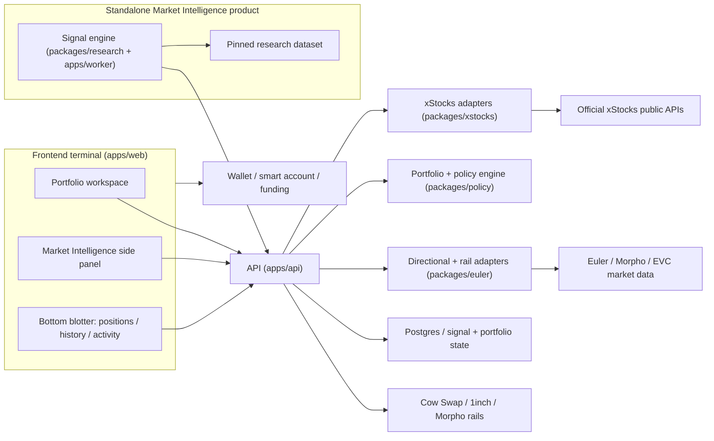
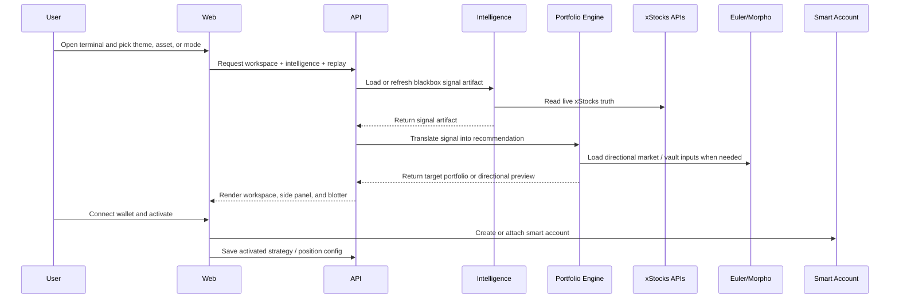

# xStocks Strategy Lab

Fresh repo created on 2026-03-31 during the xStocks hackathon window.

`xStocks Strategy Lab` is an xStocks-first product with two connected modes:
1. `Autopilot`: research, compare, and activate guarded xStocks basket strategies.
2. `Directional Vault`: use Euler as the long/short engine for leveraged long or synthetic short xStocks positions.

The product is designed so:
1. xStocks stay the core asset universe and live truth source,
2. Euler stays central for long/short strategies,
3. the frontend stays no-wallet-first,
4. the live proof path follows the strongest publicly verified rails,
5. the live proof path can fall back to Autopilot if exact xStocks-on-Euler market availability is still unverified by demo freeze.

## Product Thesis

Most hackathon apps will either:
1. show tokenized stocks in a generic trading UI, or
2. wrap finance in vague AI language.

This repo is building something sharper:
1. an xStocks-aware strategy lab for basket research and comparison,
2. a directional xStocks mode powered by Euler for long/short expression,
3. one product shell that can explain both in under two minutes.

## Modes

### Autopilot

Use xStocks public data and a pinned research dataset to:
1. compare basket candidates,
2. show why one strategy won,
3. activate a guarded strategy through a smart account.

### Directional Vault

Use Euler primitives to:
1. preview leveraged long or synthetic short structures around one xStock,
2. show health factor and liquidation distance clearly,
3. keep xStocks multiplier and route state visible alongside position risk.

Euler stays central in the product framing, but the current strongest publicly verified live lending path is `SPYx -> borrow AUSD` on Morpho. The repo should treat that as a truthful live-proof rail while Euler-specific market proof catches up.

## Current Verified Rails

As of 2026-03-31, the repo should treat these as the current verified live rails:
1. `xChange` is available on `Ethereum` and `Ink`.
2. On `Ethereum`, xChange is available on aggregators such as `Cow Swap` and `1inch`.
3. `Morpho` has a live xStocks lending path where users can deposit `SPYx` and borrow `AUSD`.

That means:
1. `Cow Swap` and `1inch` are the verified Ethereum execution surfaces to design around now.
2. `SPYx/AUSD` on Morpho is the strongest verified live lending proof path right now.
3. Euler remains central in the product experience and long/short thesis, but the repo should not overclaim exact live xStocks-on-Euler market availability until that is separately verified.

## Mentor-Reported Rails To Confirm Onsite

The repo also tracks one promising secondary rail from onsite guidance:
1. `Spread Finance` on `Ink` as a trading terminal powered by `Cow Swap` and xChange atomic RFQ.

Treat this as:
1. a strong secondary execution path candidate,
2. useful for product and demo planning,
3. not yet promoted to the same public-proof tier as Ethereum `Cow Swap / 1inch` or `SPYx/AUSD` on Morpho unless we capture direct public or onsite confirmation artifacts.

## Architecture





More detail:
1. [ARCHITECTURE.md](/Users/user/PycharmProjects/xstocks-strategy-lab/ARCHITECTURE.md)
2. [docs/ROADMAP.md](/Users/user/PycharmProjects/xstocks-strategy-lab/docs/ROADMAP.md)
3. [docs/DIAGRAMS.md](/Users/user/PycharmProjects/xstocks-strategy-lab/docs/DIAGRAMS.md)
4. [docs/EXECUTION_PLAN.md](/Users/user/PycharmProjects/xstocks-strategy-lab/docs/EXECUTION_PLAN.md)
5. [docs/FRONTEND_STYLE.md](/Users/user/PycharmProjects/xstocks-strategy-lab/docs/FRONTEND_STYLE.md)
6. [docs/ISSUES.md](/Users/user/PycharmProjects/xstocks-strategy-lab/docs/ISSUES.md)
7. [docs/plans/active/README.md](/Users/user/PycharmProjects/xstocks-strategy-lab/docs/plans/active/README.md)

## Monorepo Layout

```text
apps/
  web/       Next.js frontend on Vercel
  api/       Railway API service
  worker/    Railway background jobs

packages/
  shared/    shared types and schemas
  xstocks/   official xStocks API adapters
  research/  autoresearch-style evaluation loop
  euler/     Euler market, preview, and execution helpers
  policy/    strategy and activation-policy compilation
```

## What We Are Doing Now

### Phase 1: foundation

1. lock the repo shape and docs,
2. scaffold the frontend shell with no-wallet-first onboarding,
3. wire xStocks live-state adapters,
4. define the research artifact schemas.

Critical-path and parallel split:
1. [docs/EXECUTION_PLAN.md](/Users/user/PycharmProjects/xstocks-strategy-lab/docs/EXECUTION_PLAN.md)

### Phase 2: product proof

1. build starter baskets and comparison view,
2. build `$1,000 replay` and explanation surfaces,
3. build smart-account activation flow,
4. build Euler directional preview with health-factor and liquidation-distance panels.

### Phase 3: live proof

1. confirm exact demo asset and chain,
2. confirm exact xStocks + Euler market path if available,
3. otherwise use the currently verified live rails:
   - Ethereum xChange through Cow Swap or 1inch
   - SPYx/AUSD lending on Morpho
4. wire one truthful execution or dry-run path,
5. cut the two-minute demo.

## Current Scope Rules

1. one fresh hackathon repo only,
2. one frontend app only,
3. xStocks-only asset universe,
4. Ethereum mainnet default,
5. Euler stays central for long/short,
6. current verified Ethereum execution surfaces are Cow Swap and 1inch,
7. current verified live lending path is SPYx/AUSD on Morpho,
8. Autopilot stays the shared substrate and fallback live path.

## Status

Current repo status:
1. scaffolded,
2. documented,
3. ready for implementation.
