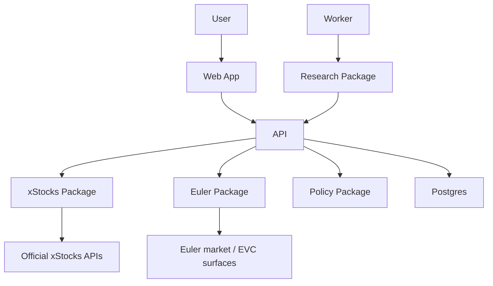
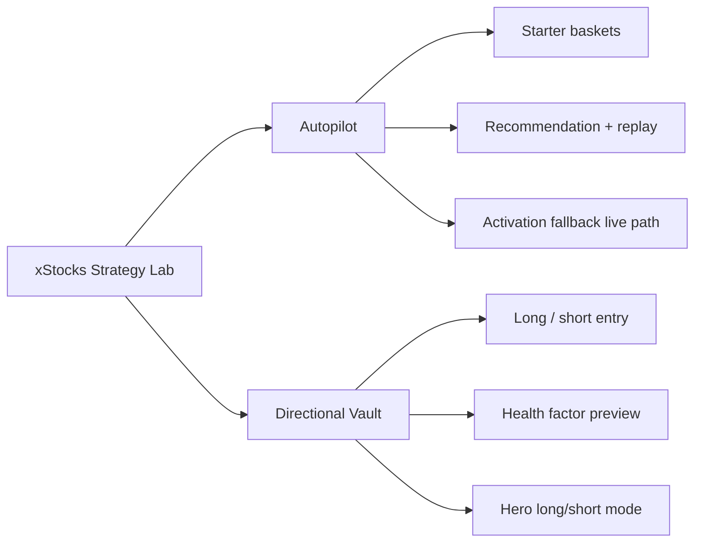
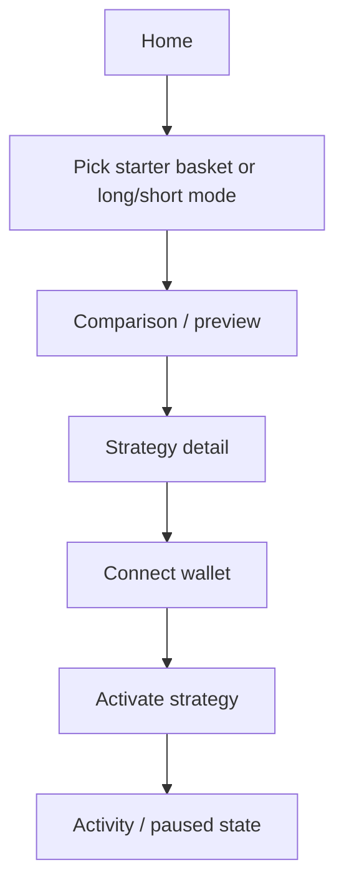

# Diagrams

## System Diagram

```mermaid
flowchart TD
    A["User"] --> B["Web App"]
    B --> C["API"]
    C --> D["xStocks Package"]
    C --> E["Euler Package"]
    C --> F["Policy Package"]
    G["Worker"] --> H["Research Package"]
    H --> C
    D --> I["Official xStocks APIs"]
    E --> J["Euler market / EVC surfaces"]
    C --> K["Postgres"]
```

## Product Modes

```mermaid
flowchart LR
    A["xStocks Strategy Lab"] --> B["Autopilot"]
    A --> C["Directional Vault"]
    B --> D["Starter baskets"]
    B --> E["Recommendation + replay"]
    B --> F["Activation fallback live path"]
    C --> G["Long / short entry"]
    C --> H["Health factor preview"]
    C --> I["Hero long/short mode"]
```

## First User Journey

```mermaid
flowchart TD
    A["Home"] --> B["Pick starter basket or long/short mode"]
    B --> C["Comparison / preview"]
    C --> D["Strategy detail"]
    D --> E["Connect wallet"]
    E --> F["Activate strategy"]
    F --> G["Activity / paused state"]
```
