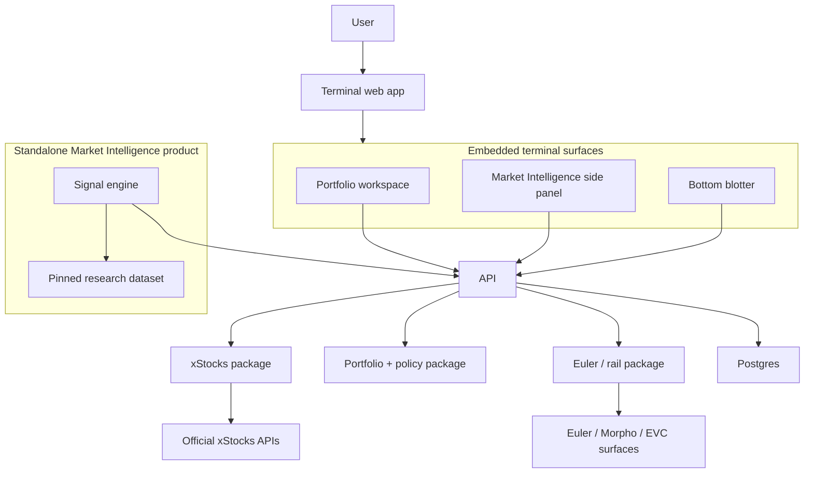
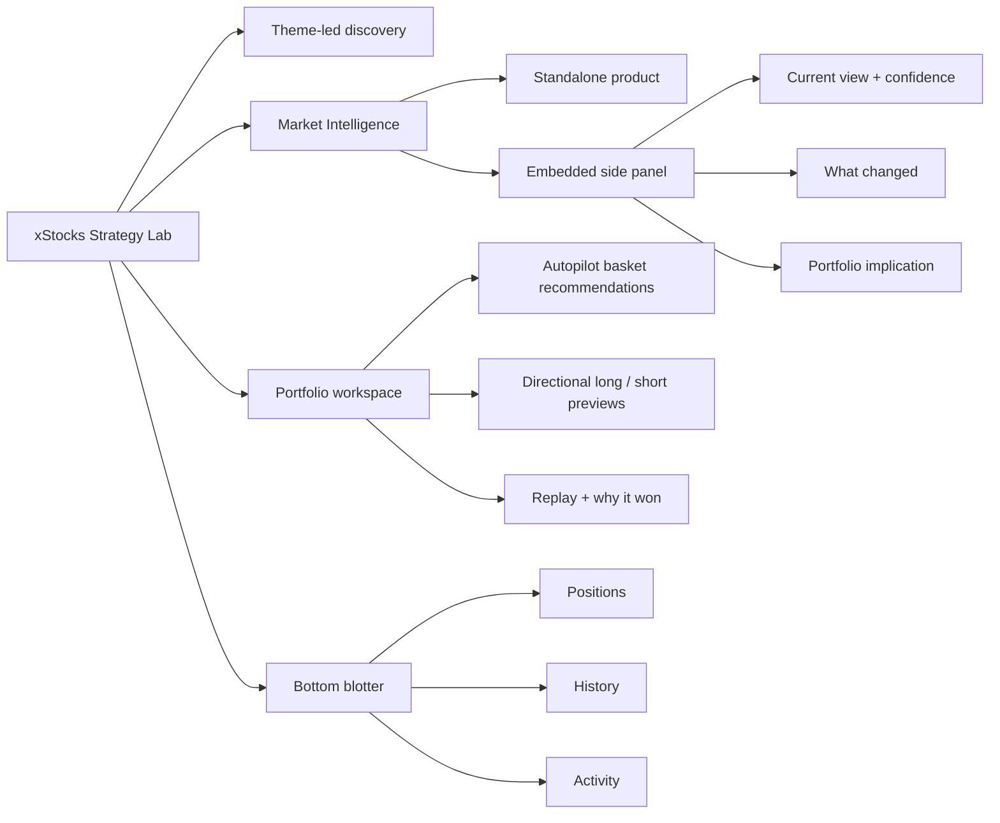
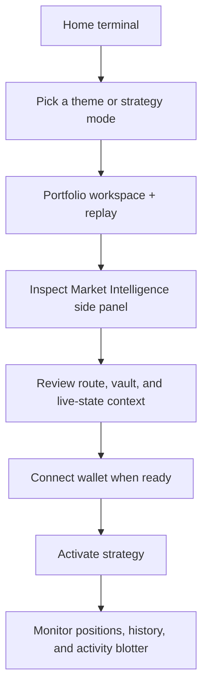

# Diagrams

## System Diagram

```mermaid
flowchart TD
    A["User"] --> B["Terminal web app"]
    subgraph T["Embedded terminal surfaces"]
        C["Portfolio workspace"]
        D["Market Intelligence side panel"]
        E["Bottom blotter"]
    end
    B --> T
    C --> F["API"]
    D --> F
    E --> F
    subgraph M["Standalone Market Intelligence product"]
        G["Signal engine"]
        H["Pinned research dataset"]
    end
    F --> I["xStocks package"]
    F --> J["Portfolio + policy package"]
    F --> K["Euler / rail package"]
    G --> F
    G --> H
    I --> L["Official xStocks APIs"]
    K --> N["Euler / Morpho / EVC surfaces"]
    F --> O["Postgres"]
```

## Product Surface

```mermaid
flowchart LR
    A["xStocks Strategy Lab"] --> B["Theme-led discovery"]
    A --> C["Portfolio workspace"]
    A --> D["Market Intelligence"]
    A --> E["Bottom blotter"]
    D --> F["Standalone product"]
    D --> G["Embedded side panel"]
    C --> H["Autopilot basket recommendations"]
    C --> I["Directional long / short previews"]
    C --> J["Replay + why it won"]
    G --> K["Current view + confidence"]
    G --> L["What changed"]
    G --> M["Portfolio implication"]
    E --> N["Positions"]
    E --> O["History"]
    E --> P["Activity"]
```

## First User Journey

```mermaid
flowchart TD
    A["Home terminal"] --> B["Pick a theme or strategy mode"]
    B --> C["Portfolio workspace + replay"]
    C --> D["Inspect Market Intelligence side panel"]
    D --> E["Review route, vault, and live-state context"]
    E --> F["Connect wallet when ready"]
    F --> G["Activate strategy"]
    G --> H["Monitor positions, history, and activity blotter"]
```
